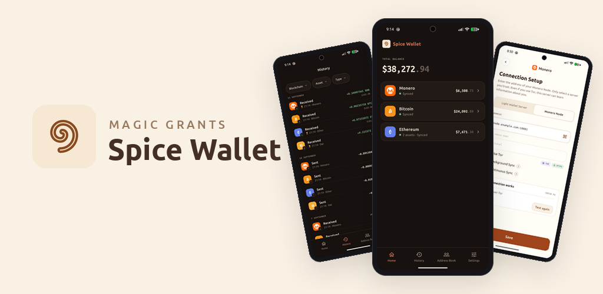

# Spice Wallet



An open-source and self-custody wallet for Monero, Bitcoin, Ethereum, and Dai, built with Flutter by [MAGIC Grants](https://magicgrants.org). One seed, every asset, on mobile and desktop.

**Website:** [spicewallet.org](https://spicewallet.org)


## Features

- **One seed, every asset.** Monero, Bitcoin, Ethereum, and Dai sit side by side, all secured by a single 15-word BIP39 seed phrase. Serai will be added as soon as it goes live.
- **Built-in Tor.** Tor comes bundled. Connect only the services you need over Tor, disable it entirely, or point Spice Wallet at Orbot or a Tor daemon you run yourself.
- **No more waiting to sync.** The servers you choose can do the scanning, so your history is ready when you open the app. Or scan locally on your device if you prefer.
- **Your servers, your choice.** Spice Wallet ships with no default servers. Each asset connects through a server you specify: a light-wallet server (LWS) or Monero node for Monero, an Electrum server for Bitcoin, and an RPC endpoint for Ethereum and Dai.
- **Reproducible builds**, so you can verify that the app you run matches the code in this repository.

Spice Wallet shares its wallet engine with [Skylight Wallet](https://github.com/MAGICGrants/skylight-wallet), MAGIC Grants' Monero-only wallet.

## Install

<div align="center">

[](https://apps.apple.com/us/developer/magic-grants/id1877162648)
[](https://play.google.com/store/apps/details?id=org.magicgrants.spice)

</div>

Android APKs are also available from the [latest release](https://github.com/MAGICGrants/spice-wallet/releases/latest).

### Desktop

#### Linux

Download from [latest release](https://github.com/MAGICGrants/spice-wallet/releases/latest), ``.AppImage`` to run on any distribution, ``.deb`` for Debian.

#### Windows

Download from [latest release](https://github.com/MAGICGrants/spice-wallet/releases/latest) the ``.exe`` file.

### Verify release signatures

Each release artifact has a detached GPG signature (``.asc``). Verify downloads before installing. This applies to all signed files (``.deb``, ``.AppImage``, ``.exe``, ``.apk``, ``.aab``, etc.).

**1. Import the signing key** (one-time):

```bash
curl -LO https://magicgrants.org/files/app-signing-key.asc
gpg --import app-signing-key.asc
```

Confirm the fingerprint matches:

```
65C4 1CFC AE37 B3B2 72AC  40BE A555 F5F7 B1FF 5885
```

```bash
gpg --fingerprint '65C4 1CFC AE37 B3B2 72AC  40BE A555 F5F7 B1FF 5885'
```

The key owner should be `MAGIC Grants <info@magicgrants.org>`.

**2. Download the artifact and its signature** from the release page. Example for v1.1.0 on amd64:

```bash
curl -LO https://github.com/MAGICGrants/spice-wallet/releases/download/v1.1.0/spice-wallet-v1.1.0-amd64.deb
curl -LO https://github.com/MAGICGrants/spice-wallet/releases/download/v1.1.0/spice-wallet-v1.1.0-amd64.deb.asc
```

**3. Verify the signature**:

```bash
gpg --verify spice-wallet-v1.1.0-amd64.deb.asc spice-wallet-v1.1.0-amd64.deb
```

A successful verification prints `Good signature from "MAGIC Grants <info@magicgrants.org>"`. Substitute the artifact and ``.asc`` filenames for other platforms (e.g. ``.AppImage``, ``.exe``, ``.apk``).

## Prerequisites

Before you begin, ensure you have the following installed:

- **Flutter SDK** (3.8.1 or higher) - [Installation guide](https://docs.flutter.dev/get-started/install)
- **Dart SDK** (3.8.1 or higher) - Usually comes with Flutter
- **Android Studio** - For Android development
- **Android SDK** - API level 21+ (Android 5.0 Lollipop or higher)
- **Java JDK** - Version 11 or higher

## Getting Started

### 1. Clone the Repository

```bash
git clone https://github.com/magicgrants/spice-wallet.git
cd spice-wallet
```

### 2. Install Dependencies

```bash
flutter pub get
```

### 3. Configure Android Development Environment

1. **Install Android Studio** and the Android SDK
2. **Accept Android licenses**:
   ```bash
   flutter doctor --android-licenses
   ```
3. **Set up a device**:
   - Use an Android emulator (AVD Manager in Android Studio), or
   - Connect a physical Android device with USB debugging enabled
4. **Verify setup**:
   ```bash
   flutter doctor
   ```
   This will check for any missing dependencies

## Development

### Running the App

#### Debug Mode (Development)

Run the app in debug mode with hot reload:

```bash
# Run on connected device or emulator
flutter run

# List available Android devices/emulators
flutter devices

# Run on a specific device
flutter run -d <device_id>
```

Make sure you have an Android emulator running or a physical device connected before running the app.

## Building for Android

### Debug APK

Build a debug APK for testing:

```bash
flutter build apk --debug
```

The APK will be located at: `build/app/outputs/flutter-apk/app-debug.apk`

### Release APK

Build a debug APK for release:

```bash
flutter build apk --release
```

The APK will be located at: `build/app/outputs/flutter-apk/app-release.apk`

#### Split APKs by ABI (smaller file sizes)

```bash
flutter build apk --split-per-abi --release
```

This creates separate APKs for each architecture:
- `app-armeabi-v7a-release.apk` (32-bit ARM)
- `app-arm64-v8a-release.apk` (64-bit ARM)
- `app-x86_64-release.apk` (64-bit x86)

### Installing the APK

To install the built APK on your device:

```bash
# Install debug APK
flutter install

# Or manually using adb
adb install build/app/outputs/flutter-apk/app-release.apk
```

**Note**: These steps cover building for Android. Spice Wallet is also available for iOS, Linux, and Windows.

## Localization

The app uses Flutter's internationalization framework. To add a new language:

1. Create a new ARB file in `lib/l10n/` (e.g., `app_es.arb` for Spanish)
2. Copy the structure from `app_en.arb` and translate the strings
3. Run code generation:
   ```bash
   flutter gen-l10n
   ```
4. The generated localization files will be in `lib/l10n/`

## Building `libmonero_libwallet2_api_c.so`

This is needed for the wallet functions and is located at `android/app/src/main/jniLibs/<platform>/`.

These instructions should work on Ubuntu 22.04. You can use the `ubuntu:22.04` Docker image if you don't use Ubuntu as your OS.

### Install dependencies

```bash
$ apt update
$ apt install -y build-essential pkg-config autoconf libtool \
    ccache make cmake gcc g++ git curl lbzip2 libtinfo5 gperf \
    unzip python-is-python3 llvm
```

### Prepare source

```bash
$ git clone https://github.com/vtnerd/monero_c --recursive
$ cd monero_c
$ git checkout lwsf
$ git submodule update --init
$ ./apply_patches.sh monero
```

### Building

```bash
# For armeabi-v7a
$ ./build_single.sh monero armv7a-linux-androideabi -j$(nproc)

# For arm64-v8a
$ ./build_single.sh monero aarch64-linux-android -j$(nproc)

# For x86_64
$ ./build_single.sh monero x86_64-linux-android -j$(nproc)
```

## Contributing

Pull requests welcome! Thanks for supporting MAGIC Grants.

To join our Matrix community, [click here](https://matrix.to/#/#spice-wallet:monero.social).

## License

[MIT](LICENSE)
